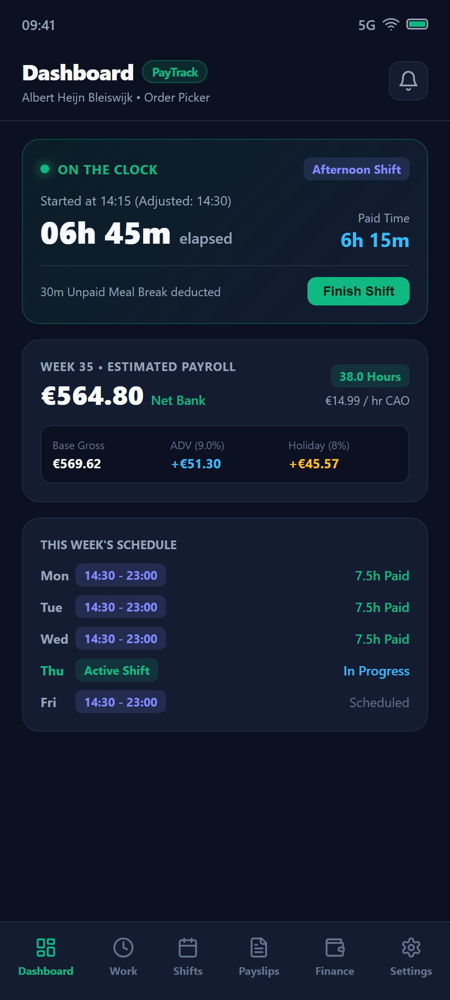
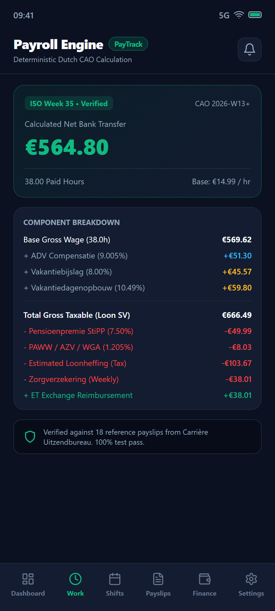
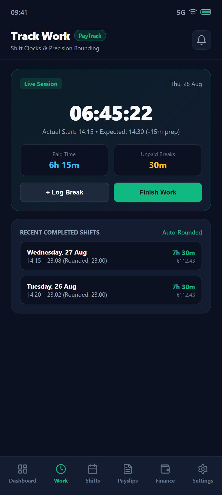
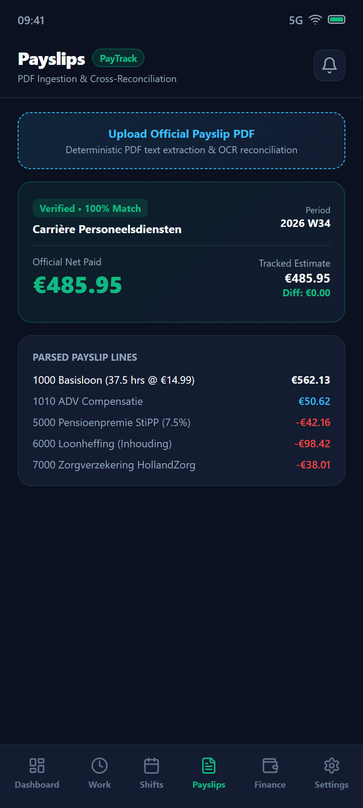
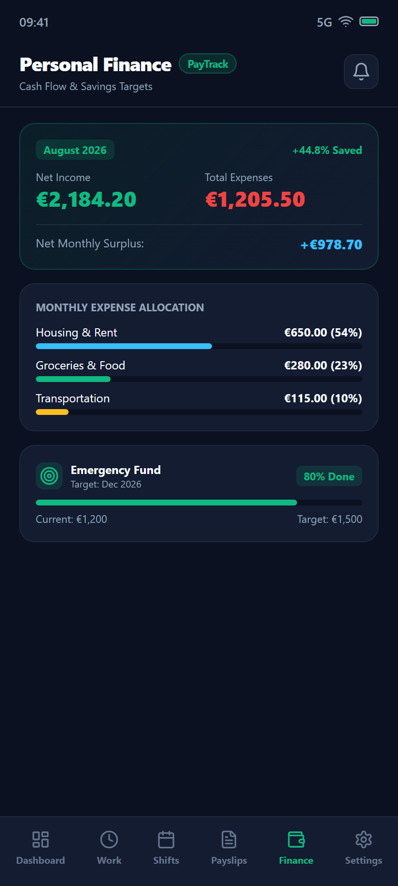
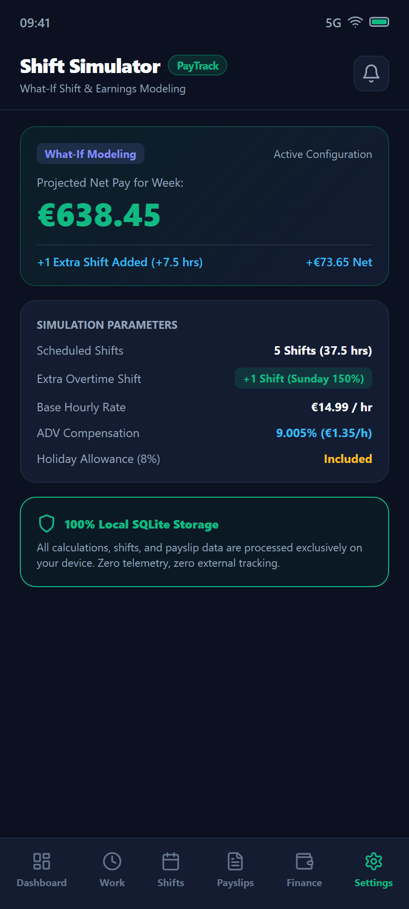
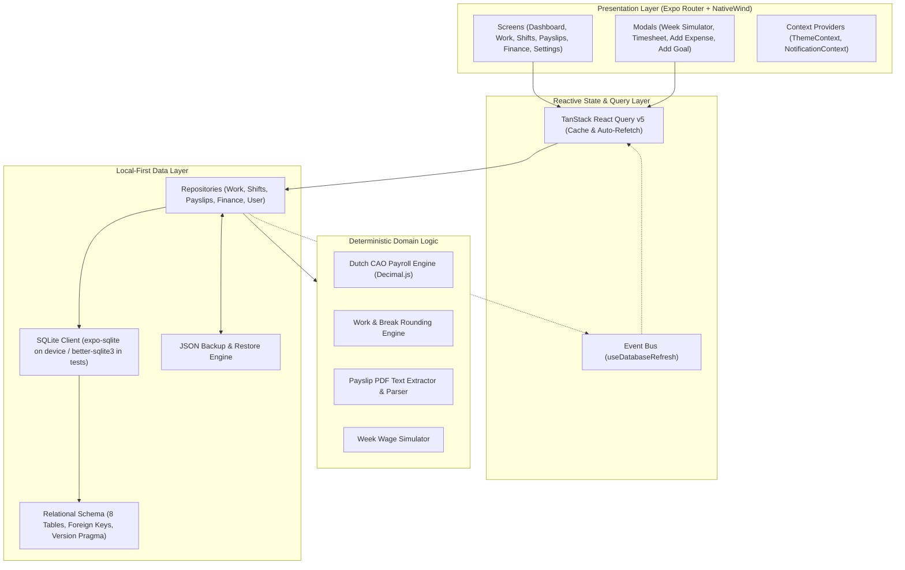

<div align="center">

# PayTrack

**Local-first mobile application for shift tracking, deterministic Dutch CAO payroll estimation, payslip reconciliation, and personal finance management.**

[](https://reactnative.dev/)
[](https://expo.dev/)
[](https://www.typescriptlang.org/)
[](https://www.sqlite.org/)
[](https://vitest.dev/)
[](https://expo.dev/)
[](docs/12-SECURITY-AND-PRIVACY.md)

</div>

---

## Overview

**PayTrack** is engineered for hourly and agency workers whose schedules and weekly earnings fluctuate. Unlike generic expense trackers or static timesheets, PayTrack connects the entire lifecycle between clocking in on the warehouse floor and managing your bank balance:

1. **Shift Tracking**: Clock in and record breaks with automatic start adjustment and 15-minute rounding rules.
2. **Deterministic Payroll Calculation**: Accurately computes base wages, ADV compensation, holiday allowance, holiday entitlement, and statutory Dutch deductions (StiPP pension, PAWW, AZV, WGA, and wage tax).
3. **Payslip Ingestion & Audit**: Parses official agency PDF payslips to verify every euro against actual logged hours.
4. **Shift Simulation**: Models "what-if" scenarios (overtime, extra shifts, Sunday premiums) to forecast net take-home pay before taking on extra work.
5. **Personal Finance**: Tracks monthly fixed obligations, variable spending categories, and progress toward savings goals.

All calculations and records reside in an isolated on-device SQLite database. No external servers or cloud accounts are required.

---

## Application Previews

<div align="center">
  <table>
    <tr>
      <td align="center" width="33%">
        
        <br />
        <sub><b>Dashboard & Live Shift</b></sub>
      </td>
      <td align="center" width="33%">
        
        <br />
        <sub><b>Deterministic CAO Payroll</b></sub>
      </td>
      <td align="center" width="33%">
        
        <br />
        <sub><b>Session & Break Tracking</b></sub>
      </td>
    </tr>
    <tr>
      <td align="center" width="33%">
        
        <br />
        <sub><b>Payslip Ingestion & Audit</b></sub>
      </td>
      <td align="center" width="33%">
        
        <br />
        <sub><b>Cash Flow & Savings Goals</b></sub>
      </td>
      <td align="center" width="33%">
        
        <br />
        <sub><b>What-If Shift Simulator</b></sub>
      </td>
    </tr>
  </table>
</div>

> Production-ready Google Play Store listing screenshots (1080 &times; 1920 px, 16:9 vertical format) are available in [`docs/store/`](docs/store/).

---

## Core Features

### 1. Shift Planning & Work-Hour Tracking
- **One-Tap Clock In/Out**: Start and finish work sessions with automatic timestamp capture.
- **Start Adjustment Rules**: Configurable arrival buffers (e.g. -15 minutes unpaid prep time).
- **Rounding Logic**: Automatic finish-time rounding to nearest 15-minute intervals according to employer payroll policies.
- **Break Management**: Distinguishes between paid breaks (e.g., 15m coffee break) and unpaid breaks (e.g., 30m meal break).
- **Bulk Scheduling**: 7-day atomic shift planning with one-tap previous-week rota duplication.

### 2. Deterministic Dutch CAO Payroll Engine
- **Accurate Gross-to-Net Engine**: Implements the Dutch Collective Labour Agreement for Temporary Agency Workers (*ABU/NBBU CAO*) and Albert Heijn logistics wage structures.
- **Itemized Allowances**:
  - Base Hourly Rate (versioned configurations: e.g., €14.99 and €15.13).
  - ADV Compensation (*Arbeidsduurverkorting*, 9.005%).
  - Holiday Allowance (*Vakantiebijslag*, 8.00%).
  - Holiday Entitlement Accrual (*Vakantiedagenopbouw*, 10.49777%).
  - Extraterritorial (ET) Tax-Free Exchange.
- **Statutory Deductions**:
  - StiPP Pension (*Stichting Pensioenfonds voor Personeelsdiensten*, 7.50%).
  - PAWW (*Private Aanvulling WW & WGA*, 0.10%).
  - AZV (*Aanvullende Ziektekostenverzekering*, 0.70%).
  - WGA (*Werkhervatting Gedeeltelijk Arbeidsgeschikten*, 0.405%).
  - Weekly Health Insurance (*HollandZorg* / *Zorgverzekering*).
  - Configurable Loonheffing (Wage Tax) withholding estimation.

### 3. Interactive Shift & Wage Simulator
- Interactive "What-If" weekly modeling modal.
- Test scenarios before accepting extra hours: adjust scheduled shifts, add weekend overtime, and evaluate the net bank deposit after tax bracket shifts.

### 4. Payslip Ingestion & Audit Reconciliation
- Upload official agency payslips in PDF format.
- Extracts wage components, tax withholdings, and net deposits.
- Cross-references payslip line items against logged clock hours to detect unpaid overtime or calculation variances.
- Automatic calibration engine detects systematic rate shifts and suggests updated payroll configuration profiles.

### 5. Personal Finance & Cash Flow Forecasting
- Monthly financial overview showing Net Income, Fixed Obligations, and Variable Expenses.
- Categorized expense tracking with custom categories and color coding.
- Recurring fixed bill management (rent, insurance, transport).
- Dedicated savings goals with deadline tracking, monthly required targets, and progress visualization.

### 6. Local-First Offline Data & Privacy
- Zero telemetry, zero external trackers, and zero compulsory cloud sync.
- ACID-compliant local transactions using SQLite (`expo-sqlite`).
- Full database export and import to JSON for seamless manual backup and restore.

---

## Architecture & Data Flow

PayTrack employs a strict **Local-First Repository Pattern** with reactive caching powered by TanStack React Query. All business logic and financial calculations are isolated from the presentation layer.



---

## Tech Stack

| Technology | Purpose | Notes |
| :--- | :--- | :--- |
| **React Native** (0.86.3) | Mobile Runtime | High-performance mobile UI framework |
| **React** (19.2.3) | Component Architecture | Concurrent rendering and hooks |
| **Expo** (SDK 57) | Native Tooling & Ecosystem | File-based navigation via Expo Router |
| **TypeScript** (6.0.3) | Type Safety | Strict typing enabled across database & business logic |
| **SQLite** (`expo-sqlite` ~57.0.10) | Local-First Storage | Offline relational database with foreign key constraints |
| **TanStack React Query** (v5.102.8) | Data Fetching & Sync | Reactive query invalidation across navigation tabs |
| **NativeWind** (v4.2.6) & **TailwindCSS** | UI Styling | Utility-first CSS tailored for mobile views |
| **Lucide React Native** (v1.38.0) | Iconography | Clean, consistent vector icons |
| **Decimal.js** (v10.4.3) | Financial Precision | Prevents floating-point rounding errors in payroll calculations |
| **date-fns** & **date-fns-tz** | Date & Time Arithmetic | Strict ISO 8601 week calculations and Amsterdam timezone handling |
| **Better-SQLite3** (v11.8.1) | Headless Testing Driver | In-memory SQLite execution for fast automated test suites |
| **Vitest** (v2.1.8) | Unit & Integration Testing | 95 passing automated test specifications |

---

## Project Structure

```text
PayTrack/
├── app/                           # Expo Router file-based screens
│   ├── (tabs)/                    # Main bottom-tab navigation group
│   │   ├── _layout.tsx            # Bottom tab bar definition and icons
│   │   ├── index.tsx              # Dashboard (active shift, weekly payroll, rota preview)
│   │   ├── work.tsx               # Work tracking (live timer, session history, rounding)
│   │   ├── shifts.tsx             # Shift rota calendar (monthly grid, bulk week templates)
│   │   ├── payslips.tsx           # Payslip upload, OCR parsing & variance reconciliation
│   │   ├── finance.tsx            # Personal finance (income, fixed bills, expenses, goals)
│   │   └── settings.tsx           # Employment profile, CAO configurations & database backup
│   └── _layout.tsx                # Root layout with QueryClient & Theme providers
├── assets/                        # Icons, adaptive icons, and splash screens
├── docs/                          # Architecture guides and media assets
│   ├── screenshots/               # Raw high-resolution application screenshots
│   ├── store/                     # 1080x1920 Google Play Store listing assets
│   └── *.md                       # PRD, payroll rules, calculation specs, security policies
├── scripts/                       # Automation and asset rendering tooling
│   ├── browser.ts                 # Headless Chromium automation driver
│   ├── generate-screenshots.ts    # Automated raw UI screenshot capture script
│   ├── generate-store-assets.ts   # Automated Google Play Store asset generator
│   └── screens.ts                 # Screen UI definitions and mockup markup
├── shared/                        # Shared contracts and type definitions
├── src/
│   ├── components/                # Reusable UI modals (WeekSimulator, Timesheet, Notifications)
│   ├── database/                  # SQLite schema, migrations, connection and repositories
│   │   ├── backup.ts              # JSON database export/import functionality
│   │   ├── db.ts                  # SQLite client adapter (Expo / Better-SQLite3)
│   │   ├── init.ts                # Schema migrations and initial seed data
│   │   ├── schema.ts              # DDL schema definitions (8 relational tables)
│   │   └── repositories/          # Data access layer (User, Work, Shifts, Payslips, Finance)
│   ├── hooks/                     # Custom React hooks (useDatabaseRefresh)
│   ├── lib/                       # Helpers (calendar math, currency formatters)
│   ├── payroll/                   # Deterministic payroll & week simulation engines
│   ├── payslips/                  # PDF text extraction and Dutch payslip parsers
│   └── theme/                     # Dark & Light color palettes and ThemeContext
├── tests/                         # Vitest automated test suite (95 tests)
│   ├── fixtures/                  # Reference payslip text fixtures
│   ├── local-db/                  # Database repository integration tests
│   └── unit/                      # Payroll, rounding, calendar, and simulation unit tests
├── tools/
│   └── store-asset-generator/     # Standalone interactive HTML/CSS store asset generator
├── package.json                   # Project dependencies and executable scripts
├── tailwind.config.js             # Tailwind theme configurations
└── tsconfig.json                  # Strict TypeScript compiler options
```

---

## Installation & Local Development

### Prerequisites
- **Node.js**: `v20.x` or `v22.x` (LTS recommended)
- **npm**: `v10.x` or higher
- **Expo Go** on mobile or Android/iOS Simulator

### 1. Clone & Install
```bash
git clone https://github.com/Jessitoii/PayTrack.git
cd PayTrack
npm install
```

### 2. Run Test Suite
PayTrack includes 95 automated unit and integration tests verifying all payroll formulas, break rounding rules, PDF parser patterns, and database repositories:
```bash
npm test
```

### 3. Verify TypeScript Strict Types
```bash
npm run typecheck
```

### 4. Start Local Development Server
```bash
npx expo start
```
- Press `a` to open in an Android emulator or connected device.
- Press `i` to open in the iOS simulator.
- Scan the displayed QR code with the **Expo Go** app to test on a physical device.

---

## Screenshot & Store Asset Automation

PayTrack includes built-in scripts to capture application screenshots and render Google Play Store listing assets automatically via headless Chromium.

### Generate Raw Application Screenshots
Renders high-DPI screenshots of all 6 core application views into `docs/screenshots/`:
```bash
npm run generate:screenshots
```

### Generate Google Play Store Visuals
Renders 6 production-ready store listing assets (1080 &times; 1920 px, 16:9 vertical format, compliant with Google Play Console policies) into `docs/store/`:
```bash
npm run generate:store-assets
```

### Interactive Store Asset Generator
An interactive web-based asset customizer is available in [`tools/store-asset-generator/index.html`](tools/store-asset-generator/index.html). Open this file in any browser to preview headlines, adjust copy, and preview mockups in real time.

---

## Google Play Store Asset Specifications

The generated visuals in [`docs/store/`](docs/store/) conform to Google Play Store requirements:

| Parameter | Specification | Compliance Status |
| :--- | :--- | :--- |
| **Dimensions** | 1080 &times; 1920 pixels | Meets standard portrait requirement |
| **Aspect Ratio** | 16:9 (1:1.77) | Complies with max 2:1 ratio |
| **Format** | 24-bit PNG (no alpha) | Validated |
| **File Size** | ~630 KB – 660 KB per file | Well within the 8 MB maximum |
| **Safe Margins** | Top padding > 100px, bottom padding > 60px | No clipping on any device viewport |
| **Design Integrity** | Clean dark theme, titanium bezel frame | Focused entirely on genuine app features |

---

## Database Schema & Storage

PayTrack stores all operational data in `paytrack_local.db` across 8 relational tables:

```text
user_profile            -> User identity, locale, currency, baseline savings
employments             -> Employer name, agency, role, location, active flag
payroll_configurations  -> Versioned CAO hourly rates, ADV, holiday, and deduction rates
shifts                  -> Planned rota dates, shift types, and arrival adjustments
work_sessions           -> Actual clock timestamps, elapsed minutes, rounded finish
work_breaks             -> Break intervals (paid vs unpaid)
payroll_weeks           -> Aggregated weekly gross, net, loon SV, and deductions
payslips                -> Ingested PDF documents, parsed components, and variance status
expense_categories      -> User categories for budgeting
expenses                -> Logged variable transactions
recurring_expenses      -> Monthly fixed obligations (bills, rent)
savings_goals           -> Target savings buffers and deadlines
```

---

## Open Banking Integration (Enable Banking)

PayTrack supports automated bank transaction synchronization and balance tracking via the **Enable Banking API** (PSD2 Open Banking) with **ING Netherlands**:

```text
React Native / Expo Mobile App
        │
        │ HTTPS (EXPO_PUBLIC_API_URL)
        ▼
Vercel Serverless Functions (/api/bank/*)
        │
        │ RS256 JWT (Signed with ENABLE_BANKING_PRIVATE_KEY)
        ▼
Enable Banking API (api.enablebanking.com)
        │
        ▼
ING Netherlands (PSD2 Consent Flow)
```

- **Architecture**: Stateless Vercel Serverless Functions + Local-first SQLite (`expo-sqlite`).
- **Security**: The RSA private key (`ENABLE_BANKING_PRIVATE_KEY`) lives exclusively in Vercel environment variables and is never exposed to the client or committed to version control.
- **Smart Categorization**: Transactions are automatically categorized against Dutch merchants (Albert Heijn, NS, Kruidvat, Bol.com, Spotify).
- **€160 Monday Rent Protection**: Detects weekly €160 Monday rent transactions and tags them as rent matches (`isRentMatch = 1`) to eliminate double-counting with recurring expenses.
- **Privacy & Terms**: Accessible legal URLs for Enable Banking application review are available at `/privacy` and `/terms`.

For complete setup instructions, see [`docs/ENABLE_BANKING_ING_SETUP.md`](docs/ENABLE_BANKING_ING_SETUP.md).

---

## Quality & Standards

- **Zero Floating-Point Error**: Financial calculations are executed using `Decimal.js` to eliminate binary rounding errors.
- **Timezone Awareness**: All shift calculations, week bounds, and dates are normalized to `Europe/Amsterdam` via `date-fns-tz`.
- **Offline Reliability**: SQLite transactions ensure atomic updates when copying weekly rotas or importing backup files.
- **Continuous Validation**: 95 test specifications execute across 13 test suites on every release cycle.

---

## License & Proprietary Notice

This repository is currently private and proprietary. All rights reserved. If you intend to distribute or open-source this codebase, review and select an appropriate open-source license (such as MIT or Apache-2.0).
